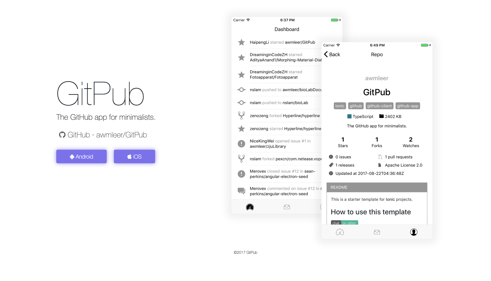

# GitPub

[](https://gitter.im/git_pub/Lobby?utm_source=badge&utm_medium=badge&utm_campaign=pr-badge&utm_content=badge)

The GitHub app for minimalists.  [HomePage](https://awmleer.github.io/GitPub/index.html)



## Overview

GitPub is built with [ionic](https://ionicframework.com/) framework (Angular+typescript+cordova), and uses GitHub api v4. Thanks to Angular's aot compilation, the iOS app/Android apk has an incredible small size (about 3~5M), while offering quite a few features.

 Feel free to open issues if you find any bug or have any idea about GitPub.

## Develop

Preparation:

```bash
$ sudo npm install -g ionic cordova
$ cd GitPub
$ npm install
```

Start dev:

```bash
$ ionic serve
```

Build:

```bash
# iOS
$ ionic cordova build ios --prod
# Android
$ ionic cordova build android --release --prod
$ ./signApk.sh
```

## Commit Notation

- [+] add
- [-] remove
- [=] update
- [$] init
- [#] document
- [^] improve
- [~] refactor
- [!] fix
- [*] try
